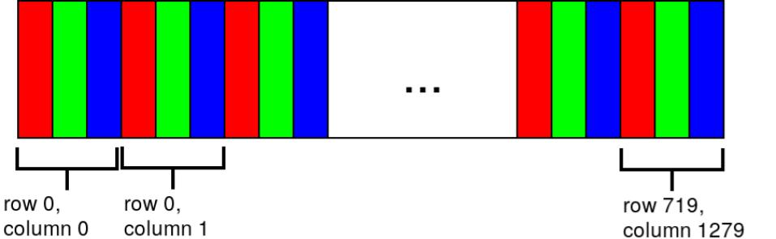
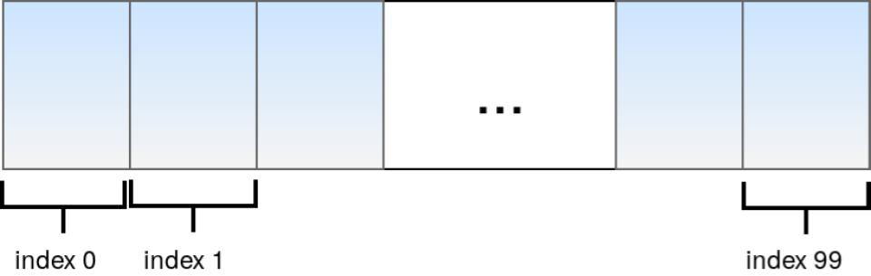

.. _c_api:

Isaac C API
===========

The Isaac C API allows you to use Isaac SDK features without needing to fully integrate the Isaac
SDK into your software stack. It also empowers you to build Isaac applications with languages other
than C++.

The C API supports sending messages to and from Isaac using the "JSON & buffers" format. In this
format, most of the high-level message data is stored in a JSON object, while large data blocks,
such as images and tensors, are stored in byte buffers.

Samples
-------

Isaac SDK contains two sample applications that illustrate how to use the C API:

* :code:`//apps/tutorials/c_api/viewer.c`
* :code:`//apps/tutorials/c_api/depth.c`

These samples work with dummy images and publish/receive messages via the C API. When you run
:code:`viewer.c`, you can view the image in :ref:`Sight <sight-overview>`.

Use the following commands to run the samples:

.. code-block:: bash

   bazel run //apps/tutorials/c_api:c_api_viewer
   bazel run //apps/tutorials/c_api:c_api_depth

Starting and Stopping an Application
------------------------------------

Every Isaac application that uses the C API requires a :ref:`JSON app file <ping_cpp>`; for example,
the samples above have corresponding :code:`viewer.app.json` and :code:`depth.app.json` files.
Use the application graph of the JSON app file to define nodes that you wish to communicate with
using the C API.

To start an Isaac application, load the JSON file as follows:

.. code-block:: c

  isaac_handle_t app;
  isaac_create_application("", "path/to/config.app.json", 0, 0, 0, 0, &app);
  isaac_start_application(app);

To shut down the application, use the following:

.. code-block:: c

   isaac_stop_application(app);
   isaac_destroy_application(&app);

Publishing a Message to Isaac
-----------------------------

Isaac uses `Cap'n Proto`_ messages internally; however, since this message format is not universally
supported, the C API exposes message payloads as JSON. If the node receiving the message
expects a Cap'n Proto message, you will need to enable message conversion to the Cap'n Proto format.

.. _Cap'n Proto: https://capnproto.org/

Follow these steps to publish a message to Isaac:

1. Create a new message as follows:

   .. code-block:: c

      isaac_uuid_t uuid;
      isaac_create_message(app, &uuid);
      isaac_write_message_json(app, &uuid, &json);

2. Set the proto ID of the message and enable JSON-to-proto conversion as follows:

   .. code-block:: c

      isaac_set_message_proto_id(app, &uuid, proto_id);
      isaac_set_message_auto_convert(app, &uuid, isaac_message_type_proto);

   The :code:`isaac_set_message_proto_id()` call requires the proto ID of the message. To determine
   the proto ID of a message, add the message type to the :code:`//apps/tutorials/c_api:typeid`
   application, then run the application via :code:`bazel run //apps/tutorials/c_api:typeid`. The
   proto ID will be displayed at the terminal.

3. Publish the message to an Isaac application node using the :code:`isaac_publish_message()` call.
   The message will be forwarded to the node as a Cap'n Proto message.

   .. code-block:: c

      isaac_publish_message(app, "node_name", "component_name", "key", &uuid);

See :code:`//apps/tutorials/c_api/viewer.c` for an example of message publishing.

Receiving a Message from Isaac
------------------------------

To receive the most recent message from any of the nodes defined in the JSON app file, use the
following call:

.. code-block:: c

   isaac_receive_latest_new_message(app, "node_name", "component_name", "key", &uuid);

The :code:`isaac_receive_latest_new_message()` call returns either a "success" code
(:code:`isaac_error_success`) or a "no message available" code
(:code:`isaac_error_no_message_available`).

Get the contents of the message as follows:

.. code-block:: c

   isaac_const_json_t json = isaac_create_null_const_json();
   isaac_get_message_json(app, &uuid, &json);

If the message source publishes messages using Cap'n Proto, the message is automatically converted
to JSON.

As soon as you are finished processing the message, use the :code:`isaac_release_message()` call,
which allows Isaac to reclaim any resources being used for the message:

.. code-block:: c

   isaac_release_message(app, &uuid);

If you want to retain any message data, copy it before releasing the message.

See :code:`//apps/tutorials/c_api/depth.c` for an example of receiving messages.

Building the C API
------------------

Use the following command to build the C API and deploy it to a folder on your local machine:

.. code-block:: bash

   ./engine/build/deploy.sh -p //engine/alice/c_api:isaac_engine_c_api-pkg -d x86_64 -h localhost --deploy_path ~

When linking your code, you must provide paths to the shared libraries for the C API and "sight"
module, which are located here:

* :code:`<deploy_path>/engine/alice/c_api/libisaac_c_api.so`
* :code:`<deploy_path>/packages/sight/libsight_module.so`

The following is a command-line example of compilation using GCC:

.. code-block:: bash

   gcc c_api_example.c \
      -L./engine/alice/c_api -lisaac_c_api \
      -L./packages/sight -lsight_module \
      -o c_api_example

   export LD_LIBRARY_PATH=./engine/alice/c_api:./packages/sight:$LD_LIBRARY_PATH

   ./c_api_example

Locale Settings
---------------

The `locale`_ of Isaac applications is automatically set to :code:`en_US.UTF-8` to prevent decimal
conversion errors when converting JSON messages to/from proto messages. Therefore, JSON files that
are generated for communication with Isaac nodes must be compatible with the :code:`en_US.UTF-8`
locale.

.. _locale: https://wiki.archlinux.org/index.php/locale

Buffer Layout
-------------

A message proto with a buffer must store the index of the buffer containing the data. For example,
the "dataBufferIndex" in ColorCameraProto is the index of the buffer that contains the image data.

Image Buffers
^^^^^^^^^^^^^

Below is an illustration of a buffer for a 720p RGB image. Each (row, column) location contains
information regarding a pixel. Isaac image buffers are in row-major order.

.. _tensor_buffers:

Tensor Buffers
^^^^^^^^^^^^^^

In a one-dimensional tensor, the elements are stacked in order:

A two-dimensional tensor is similar to the image buffer described above: Each RGB value can be
represented as a tuple element. If the image was grayscale, each element would be a number instead.
The first element on a 2D tensor buffer is indexed as (0,0), the second element as (0,1), etc.

Similarly, a three-dimensional tensor has the following order:

.. code-block::

   (0, 0, 0), (0, 0, 1), (0, 0, 2),  …. (0, 1, 0) …. (1, 0, 0) … (max_0, max_1, max_2),

Where :code:`max_i` is the maximum index in dimension "i".

A 3D tensor can represent an RGB image, with each (row, column, channel) index pointing to a value
from 0 to 255.

Example Messages
----------------

Execute the following command to generate example JSON files in the :code:`/tmp` folder:

.. code-block:: bash

   bazel run apps/samples/proto_to_json

These JSON files, which are detailed below, correspond to common protos used in Isaac.

ColorCameraProto
^^^^^^^^^^^^^^^^

* Filename: :code:`color_camera_proto.json`
* Proto description: :ref:`ColorCameraProto`
* Proto ID: 12905539496848989000

See the :ref:`Image Buffers <tensor_buffers>` section above for an illustration of a two-dimensional
buffer layout.

RangeScanProto
^^^^^^^^^^^^^^

* Filename: :code:`range_scan_proto.json`
* Proto description: :ref:`RangeScanProto`
* Proto ID: 11901202900662173387

See the :ref:`Tensor Buffers <tensor_buffers>` section above for an explanation of the buffer
layout. In this case, there is one buffer for ranges and another buffer for intensities.
In the example JSON, the buffer size is 16x8 because the vertical beam angle (:code:`theta`) list
has 16 members, while there are  eight horizontal ray slices (associated with the :code:`phi`
angles).

StateProto (messages::DifferentialBaseDynamics)
^^^^^^^^^^^^^^^^^^^^^^^^^^^^^^^^^^^^^^^^^^^^^^^

* Filename: :code:`differential_base_state_proto.json`
* Proto description: :ref:`StateProto`
* Proto ID: 13177870757040999364

See the :ref:`Tensor Buffers <tensor_buffers>` section above for an explanation of the buffer
layout. In this case, the buffer is a 1x1x4 tensor that contains the following values:

1. Linear speed
2. Angular speed
3. Linear acceleration
4. Angular acceleration

StateProto (messages::DifferentialBaseControl)
^^^^^^^^^^^^^^^^^^^^^^^^^^^^^^^^^^^^^^^^^^^^^^

* Filename: :code:`differential_base_control_proto.json`
* Proto description: :ref:`StateProto`
* Proto ID: 13177870757040999364

See the :ref:`Tensor Buffers` section above for an explanation of the buffer layout. In this case,
the buffer is a 1x1x2 tensor that contains the following values:

1. Linear speed
2. Angular speed

